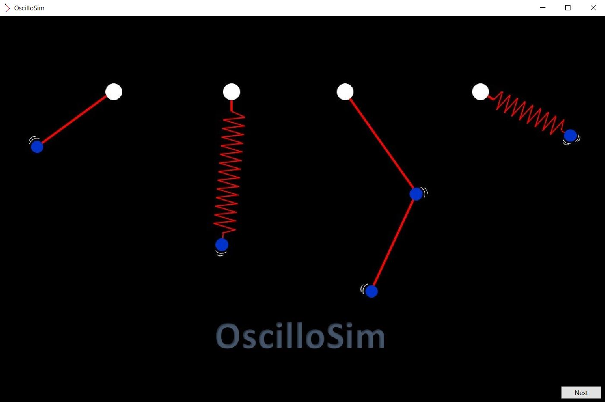

# OscilloSim

OscilloSim is a program that allows to simulate the time evolution of different type of oscillators. There are 4 different types of oscillators available to simulate:
- ``WeightedPendulum`` : A simple pendulum. A weight is a attached to end of a rod of fixed length and can swing freely or with friction. The pendulum is subject to gravity. It has one degree of freedom, the angle of the rod with respect to the vector defined by gravity. 
- ``DoublePendulum`` : Two rods and two weights. The second mass is attached to the end of the second rod which can swing freely around the first mass. The pendulum is subject to gravity. It has two degrees of freedom, the angle of the first rod with respect to the vector defined by gravity and the angle of the second rod with respect to the first rod.
- ``Spring`` : A simple spring with a mass. The length at rest is zero. The spring is forced to oscillate along an axis. There may be friction involved. The pendulum is subject to gravity. It has one degree of freedom, the position along the direction of the axis formed by the spring.
- ``SpringPendulum`` : A spring that is free to oscillate in a two dimensional plane. It has a non-zero length at rest. The pendulum is subject to gravity. It has two degrees of freedom, the x and y positions of the mass at the end of the spring. In this case the y direction is the same as gravity.

The time evolution computations are performed using integrators. There are 4 integrators available for use:
- `IntegratorEuler` : A Euler integrator.
- `IntegratorEulerCromer` : A Euler-Cromer integrator.
- `IntegratorNewmark` : A Newmark integrator. 
- `IntegratorRungeKutta` : A RK4 integrator. 

There are two different ways of simulating the oscillators, either by a text simulation or by a visual simulation. We start by explaining how to perform a text simulation.

## TextSim
Go in the TextSim folder. In order to run the simulation, two steps need to be taken :
1. make the libraries : ``make -f maketext.mk libs``
2. make the main executable : ``make -f maketext.mk``

Then one can simply run ``./OscilloSimText``

The program is contained within the TextSim/main.cpp file. Let's take a look at the code : 

First we must include the important files : 
```
#include "../Oscillators/weightedpendulum.h"
#include "../Oscillators/doublependulum.h"
#include "../Oscillators/spring.h"
#include "../Oscillators/springpendulum.h"

#include "../Simulation/integratoreuler.h"
#include "../Simulation/system.h"

#include "../Display/drawingsupport.h"
#include "../Simulation/vector.h"
#include <string>
```

In the main, we have :
```
int main(int argc, char *argv[])
{
// 1 - define drawing support, define and initialize oscillators
FileLogger t;
WeightedPendulum p("pendulum", &t, 1.0, 1.0);
Vector Q = {1.0};
p.setQ(Q);

DoublePendulum dp("doublependulum", &t, 1.0, 1.0, 1.0, 1.0);
Vector Q2 = {1.0, -1.0};
dp.setQ(Q2);

Spring sp("spring", &t, 1.0, 1.0);
Vector Q3 = {-1.0};
sp.setQ(Q3);

SpringPendulum spp("springpendulum", &t, 1.0, 1.0, 1.0);
Vector P4 = {1.0, 1.0};
spp.setP(P4);

// 2 - add oscillators to system
System s(&t, new IntegratorEuler());
s.addOscillo(p);
s.addOscillo(dp);
s.addOscillo(sp);
s.addOscillo(spp);
s.draw();

// 3 - simulate the system
double sim_time = 5.0;
double time = 0.0;
double dt = 0.01;

while(time < sim_time){
    s.evolve(dt, time);
    s.draw();
    time += dt;
    cout<<time<<endl;
}

return 0;
}
```
This may be a bit scary on first approach so let's break it down into pieces.

In the first part, we define the oscillators and set their initial velocities. We also define the ``DrawingSupport``, i.e. where the position and velocities of the oscillators over time are displayed / saved. In this example, it is a ``FileLogger``, so the output of the simulation is saved in a file format. The constructor of the different oscillators are : 
```
WeightedPendulum(std::string n, DrawingSupport* supp, double mass, double length , double fr = 0 , Vector A = {1, 0, 0}, Vector o = {0, 0, 0});

DoublePendulum(std::string n, DrawingSupport* supp, double mass1, double mass2, double length1, double length2, Vector A = {1, 0, 0}, Vector o = {0, 0, 0});

Spring(std::string n, DrawingSupport* supp, double m, double cst, double fr = 0, Vector A = {1, 0, 0}, Vector o = {0, 0, 0});

SpringPendulum(std::string n, DrawingSupport* supp, double masse, double cst, double length = 1, Vector A = {1, 0, 0}, Vector o = {0, 0, 0});
```

The ``string n`` argument is the name of the oscillator, which is then used for the name of the output files. The ``DrawingSupport* supp`` defines the medium through which the simulation is saved or displayed. The ``Vector A``, combined with the vector of gravity ``g = {0, 0, -9.81}`` forms the plane in which the oscillators evolve. Additionally, a ``Spring`` is forced to oscillate along the direction of this vector. The ``Vector o`` defines the origin of the oscillator, i.e., the point around which it swings. For ``Spring`` and ``SpringPendulum``, the ``cst`` value is the spring constant. 

It is possible to set the positions and the velocities of the oscillators using ``setP(Vector)`` and ``setQ(Vector)``. The size of the ``Vector`` must be the same as the number of degrees of freedom of the oscillator. If the original value is an angle, then its corresponding velocity is an angular velocity. 

In the second part, we define a ``System``, which contains oscillators. It is initialized with an Integrator. The respective oscillators are then added to the system. The system is drawn once. In this case, it means it outputs the positions and velocities of each oscillator in the system to a file.

In the third part, we define the total simulation time, the initial time and the time step. The system is integrated and drawn over the time of the simulation.

## VisualSim

Instead of having to write down the oscillators and the initial conditions for each oscillator in c++, which is annoying, a user interface was developed using Qt and the simulated oscillators are rendered using OpenGL. 

In order to run the user interface, Qt6 needs to be downloaded on your computer and mingw32-make available. 

In the Qt console, in the base folder,
1. run the ``qmake`` command
2. run the ``mingw32-make`` (or simply ``make`` for linux-based systems) command and wait for the console to settle down
3. cd into the ``VisualSim/release`` folder and execute the ``OscilloSim`` executable. 

A window like to following should open:



